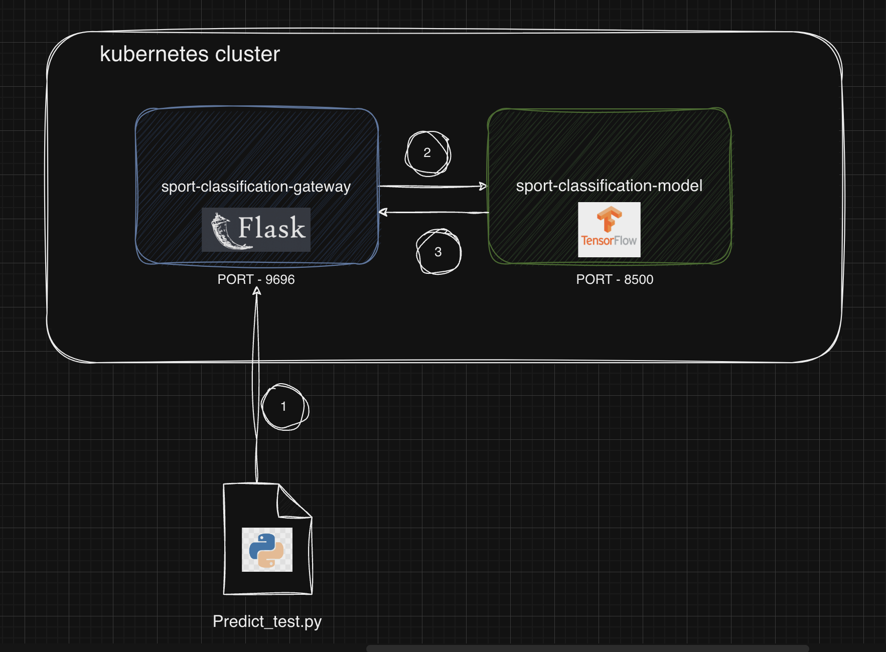

# sport_classification_service #

## Problem statement ##
We aim to address the challenge of accurate and efficient sport image classification within our service. The goal is to enhance the precision of categorizing sports based on user-provided images by leveraging a Convolutional Neural Network (CNN) model trained on a diverse sport-specific dataset. 

Kaggle data set used - https://www.kaggle.com/datasets/sidharkal/sports-image-classification

## Solution ##
As a part of this application, a pre-trained model - Inceptionv3 was further trained with a dataset containing images of different sports classes- cricket, wrestling, tennis, badminton, soccer, swimming, and karate and wrapped as tf-serving(based on the above kaggle dataset). The trained model has an accuracy of 94% in classifying the sport. Please note the training dataset contained only 7 sport classes [cricket, wrestling, tennis, badminton, soccer, swimming, and karate]


### Solution Architecture ###



## Note ##
 Images, model are checked into the repo making it a large repo interms of size. Hence git-lfs was used to store file greater than 100MB. Follow the installation instructions for git-lfs [here](https://git-lfs.com/).


### Project structure ###

Folder  | Description
------------- | -------------
dataset  | Directory containing training and test data - image files.
gateway  | Directory containing flask application which acts as a gateway for tf-serving 
model    | Directory containing '.h5' model which was trianed and tensorflow generated model which can be used in tf-serving.
trainer | Directory containing notebooks and script which were used for training the model. 
kube-config | Configuration related to kubernetes deployments.


## Pre-requisties ##
* python 3.10 or above.
* docker, docker-compose, Kind, kubectl
* pip3, pipenv  
* git-lfs

## Installing dependencies ##
Use `pipenv install` to install dependencies from respective directories, Only if you want to train model and build images yourself.

* Folder `gateway` - contains dependencies related to flask and tf-serving. 
* Folder `trainer` - contains dependencies related to tensorflow and other libraries required for training the model.


## How to run locally with Docker compose ##
1.  Clone this repo
2.  Install [git-lfs]((https://git-lfs.com/)). 
2. `git lfs pull`.(The trained model is saved in the `model` directory already)
3. `docker-compose up`
5.  check if the containers is up `docker ps`


## How to run on local kubernetes ##
1. Ensure [`kind`](https://kind.sigs.k8s.io/) kubernetes in installed
2. run `./deploy-local-kube.sh <cluster-name>`
3. `kubectl port-forward services/sports-gateway-service 9696:9696`

## Testing with python script ##
1. `cd` into `./gateway` directory
2. `pipenv install`
3. `pipenv shell`
4. `python3 predict_test.py`

## Testing with curl ##
run `./predict_test.sh`
 
 or

```shell
  curl --request POST \
  --url http://localhost:9696/predict \
  --header 'Content-Type: application/json' \
  --data '{"url": <<image url>>}'
  ```


## Cloud Deployment ##

Both the Gateway and the Model is deployed on AWS EKS cluster.

The gateway is available for testing 
url:`https://somethinghost:9696/ping`

you can test the application by running predict_test.py or curl (post modification of the host to `https://somethinghost:9696`)


## gateway Service API ##

API  | Description | Response | Response-type
------------- | ------------- | -------------  | -------------
`/ping` | ping api to check the status | pong | String
`/predict`| Return the prediction of the classification|  check below sample | Json


Sample Response for '/predict'
```JSON
{
  "prediction": "Karate",
  "probability_percentage": {
    "Badminton": 1.887187517368716e-09,
    "Cricket": 8.943498869484756e-06,
    "Karate": 0.9999909400939941,
    "Soccer": 1.0174683495733916e-07,
    "Swimming": 3.659216159246359e-12,
    "Tennis": 2.4010535781826547e-09,
    "Wrestling": 1.1995511250972868e-09
  }
}
```


